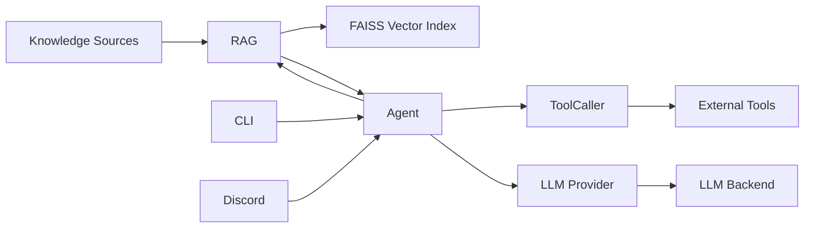

<div align="center">

# 🧠 DataCenter AI
### Context-aware AI agent with RAG, tools, session memory, and configurable LLM providers

**RAG · Semantic Search · Tool Calling · Session Memory · Extensible Providers**
<p>
  
  
  
  
</p>
Agente de IA experimental e extensível que combina recuperação semântica de conhecimento local, memória de sessão, ferramentas externas e backends de LLM compatíveis com a API OpenAI.

**Público-alvo:** desenvolvedores, estudantes e entusiastas interessados em agentes de IA, RAG, semantic search, tool calling e arquiteturas extensíveis baseadas em LLMs.

</div>

---
## Demonstração

<div align="center">


<sub>Interface CLI demonstrando uma interação com o agente e seu fluxo de geração de respostas.</sub>

</div>
## Funcionalidades
- **RAG** — recupera contexto semanticamente relevante a partir de fontes de conhecimento locais.
- **Semantic Search** — utiliza embeddings e FAISS para busca vetorial por similaridade.
- **Múltiplos formatos** — suporta fontes `.txt`, `.md`, `.json` e `.jsonl`.
- **Conhecimento opcional** — o agente continua funcionando mesmo sem uma base de conhecimento local.
- **Session Memory** — mantém o histórico da conversa durante a sessão do agente.
- **Tool Calling** — permite ao modelo solicitar e executar ferramentas externas.
- **Providers** — desacopla a lógica do agente da integração com o backend de LLM.
- **CLI** — interface local para interação direta com o agente.
- **Discord** — integração disponível através do comando `.transcend`.
- **Async** — operações de geração e execução de ferramentas utilizam fluxo assíncrono.
## Arquitetura


O `Agent` é responsável por coordenar o histórico da sessão, o contexto recuperado pelo RAG, as chamadas de ferramentas e a geração das respostas.

O RAG funciona como uma fonte adicional de contexto e não como uma dependência obrigatória. Caso nenhuma fonte de conhecimento compatível esteja disponível, o agente continua operando utilizando o backend de LLM e as ferramentas disponíveis.

As instruções gerais de comportamento do agente são definidas em [`bot/rules.txt`](bot/rules.txt).
## RAG e fontes de conhecimento

O DataCenter possui um sistema de RAG genérico para incorporar conhecimento local ao contexto do agente.

As fontes são carregadas recursivamente a partir de:

```text
data/
```

Atualmente são suportados:

| Formato | Extensão |
| --- | --- |
| Texto | `.txt` |
| Markdown | `.md` |
| JSON | `.json` |
| JSON Lines | `.jsonl` |

Documentos maiores são divididos em chunks com sobreposição para preservar parte do contexto entre segmentos.
Os textos são transformados em embeddings utilizando Sentence Transformers com o modelo `all-MiniLM-L6-v2`. Os vetores são normalizados e armazenados em um índice FAISS em memória.

Durante uma consulta:

```text
Query
  ↓
Embedding
  ↓
FAISS
  ↓
Semantic Search
  ↓
Relevant Context
  ↓
Agent
  ↓
LLM
```

A busca utiliza similaridade de cosseno através de vetores normalizados e `IndexFlatIP`.
### Base de conhecimento opcional

A pasta `data/` não precisa conter documentos para que o agente funcione.

Caso nenhum arquivo suportado seja encontrado:

```text
RAG unavailable
      ↓
Agent continues
      ↓
LLM + Tools + Session Context
```

Nesse estado, nenhuma informação é apresentada ao modelo como se tivesse sido recuperada de uma base local.

Isso permite utilizar o DataCenter tanto com uma base de conhecimento própria quanto como um agente independente.
## Providers

| Componente | Papel |
| --- | --- |
| `BaseProvider` | Define o contrato assíncrono comum para providers. |
| `OpenAICompatible` | Implementação para APIs compatíveis com o protocolo utilizado pela SDK `openai`. |
| LLM backend | Endpoint responsável pela geração das respostas. |

A arquitetura de providers mantém o agente desacoplado do serviço utilizado para inferência.
Endpoint, chave de API e modelo são definidos através de variáveis de ambiente, permitindo utilizar diferentes backends compatíveis sem alterar a lógica principal do agente.

Atualmente, `OpenAICompatible` é a implementação utilizada pela aplicação.
## Tools

O agente possui uma camada independente para registro e execução de ferramentas.

| Tool | Descrição |
| --- | --- |
| `sherlock` | Pesquisa um username em serviços públicos; requer o executável Sherlock no `PATH`. |
| `holehe` | Consulta serviços associados a um e-mail; requer o executável Holehe no `PATH`. |
| `search` | Realiza pesquisas na web utilizando `googlesearch-python`. |

O `ToolCaller` atua como intermediário entre o agente e as implementações disponíveis em `tools/`.
A arquitetura permite adicionar novas ferramentas sem acoplar suas implementações diretamente à lógica principal do agente.
## Tech Stack

<div align="center">


<br><br>


</div>
## Configuração

`config.py` utiliza variáveis de ambiente para configurar as integrações e o backend de LLM:

| Variável | Uso |
| --- | --- |
| `LLM_INTEGRATION_TOKEN` | Token utilizado pela integração com Discord. |
| `LLM_API_KEY` | Chave de acesso ao endpoint de LLM. |
| `LLM_BASE_URL` | URL base do backend compatível. |
| `LLM_MODEL` | Identificador do modelo utilizado. |
| `LLM_PROVIDER` | Identificador reservado para seleção de provider. |
O [`.env.example`](.env.example) contém a estrutura esperada:

```dotenv
LLM_INTEGRATION_TOKEN=seu_token
LLM_API_KEY=sua_chave
LLM_BASE_URL=https://seu-endpoint-compativel/v1
LLM_MODEL=seu-modelo
LLM_PROVIDER=openaicompatible
```

> `LLM_PROVIDER` já faz parte da configuração, mas a seleção dinâmica de implementações ainda não está disponível.
## Instalação

### 1. Clone o repositório

```bash
git clone https://github.com/quixaba-dev/DataCenter.git
cd DataCenter
```

### 2. Crie um ambiente virtual

```bash
python -m venv .venv
```

Linux/macOS:

```bash
source .venv/bin/activate
```

Windows PowerShell:

```powershell
.\.venv\Scripts\Activate.ps1
```

### 3. Instale as dependências

```bash
pip install -r requirements.txt
```
### 4. Configure o ambiente

Copie:

```text
.env.example
```

para:

```text
.env
```

e configure suas credenciais e o backend de LLM.

### 5. Adicione conhecimento local (opcional)

Arquivos de conhecimento podem ser adicionados em:

```text
data/
```

Por exemplo:

```text
data/
├── knowledge.txt
├── documentation.md
├── dataset.json
└── records.jsonl
```

Essa etapa é opcional. O agente pode ser iniciado normalmente sem fontes de conhecimento.

## Execução
### Aplicação

A partir da raiz do projeto:

```bash
python main.py
```

### CLI

A interface CLI permite interagir diretamente com o agente pelo terminal:

```bash
python cli.py
```

#### Exemplo de uso

```text
$ python cli.py

DataCenter AI CLI
Digite 'exit' para sair.

> Explique em uma frase o que é RAG.

RAG combina recuperação de informações relevantes com geração por um modelo de linguagem para produzir respostas contextualizadas.
```

> O conteúdo exato da resposta pode variar de acordo com o modelo e o backend de LLM configurados.

### Discord

Na integração com Discord:

```text
.transcend <pergunta>
```

Respostas maiores são divididas para respeitar o limite de tamanho das mensagens.

> A integração atual utiliza `discord.py-self` com `self_bot=True`, automatizando uma conta de usuário. Verifique os termos aplicáveis da plataforma antes de utilizá-la.
## Estrutura
```text
.
├── assets/
│   └── demo.gif             # Demonstração do projeto
├── bot/
│   ├── discord.py           # Integração com Discord
│   └── rules.txt            # Instruções do agente
├── core/
│   ├── agent.py             # Orquestra memória, RAG, tools e provider
│   └── rag.py               # Carregamento, embeddings e recuperação
├── data/                    # Fontes opcionais de conhecimento
├── evals/
│   └── manual_eval.py       # Avaliação exploratória
├── providers/
│   ├── base.py              # Interface comum dos providers
│   └── openaicompatible.py  # Provider OpenAI-compatible
├── tools/
│   ├── ToolCaller.py        # Registro e dispatch de tools
│   └── tools.py             # Implementações das ferramentas
├── utils/
│   └── logging.py           # Configuração de logs
├── cli.py                   # Interface de linha de comando
├── config.py                # Configuração da aplicação
├── main.py                  # Entry point
└── requirements.txt
```
## Limitações conhecidas

- O índice FAISS é reconstruído em memória a cada inicialização.
- O modelo de embeddings é carregado localmente durante a inicialização do RAG.
- `LLM_PROVIDER` ainda não realiza seleção dinâmica de providers.
- O agente ainda não possui um agent loop completo para múltiplos ciclos consecutivos de `LLM → Tool → LLM`.
- A avaliação em `evals/manual_eval.py` pode realizar chamadas reais ao backend configurado.
- A integração atual com Discord utiliza modo self-bot.
## Roadmap

Algumas evoluções planejadas para a arquitetura:

- Agent loop para múltiplas chamadas de ferramentas.
- Seleção dinâmica de providers.
- Persistência do índice vetorial.
- Expansão do sistema de tools.
- Melhorias na estratégia de chunking e recuperação.
- Avaliações automatizadas do comportamento do agente.

## License

Distributed under the MIT License. See [`LICENSE`](LICENSE) for details.

---

<div align="center">
### DataCenter AI

`LLM` • `RAG` • `Semantic Search` • `Tool Calling` • `Session Memory`

Built with Python 🐍

</div>
